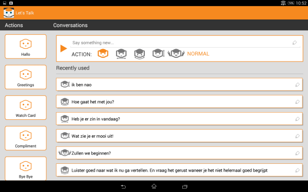
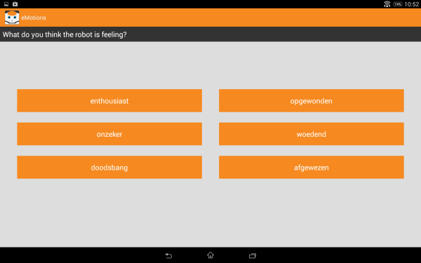

# NaoTherapist

This project, called **NaoTherapist**, is an outcome of the [Wikitherapist Project](http://www.tue.nl/onderzoek/instituten-groepen-scholen/robotics/projects/wiki-therapist/)

This software has been developed for Tablet Android devices starting on 3.0 and allows the user to launch different exercises (incorporated on this software) on the Aldebaran's Nao Robot.

# How to use it

The application needs the [ServerBox](ServerBox Link) behaviour running on the robot. The robot and the tablet have to been connected to the same network.

This application incorporates two different exercises:

## Conversations

The *Conversations Exercise* has been designed together with the Orion School (Amsterdam - The Netherlands).

The aim of this exercise is help to autistic children to make appropriate questions. The exercise requires the robot, a set of cards with pictures and a therapist. The therapist controls the robot actions and speech. The robot has a card with a picture and the child has to figure out the picture. To discover the picture, the child can make any question he thinks appropriate.

On this case, the tablet offers different control to make the robot move and talk, letting the therapist to encourage, correct or congratulate the child.

This exercise can be also used to control the robot, launching different behaviours and setting the robot speech.

## Emotions

This exercise has been designed together with the Orion School (Amsterdam - The Netherlands).

The aim of the exercise is to improve the children capabilities to identify emotions expressed with body language. Along the exercise, the robot uses the body language to perform an emotion (without sounds or special color on the robot eyes) that the child has to identify.

Along the exercise, the child has to identify several emotions. For the identification the child uses the tablet, where different options are offered. In the case of a right answer the robot congrats the child and the next emotion is shown. In the case of a wrong answer, the robot offers the possibility to perform the emotion again.

The emotions are divided in four groups: happy, sad, fear, angry. Every group has three of four variations. For example, the *happy* group includes **cheerful**, **excited** and **enthusiastic**.

The game has two modes to make easier the emotion identification. In the first mode, the easier, the answer is correct if the pointed emotion belongs to the same group that the emotion made by the robot. So, if the robot express **cheerful** but the child identifies the emotion as **excited**, the answer is correct. In the second mode, the more difficult, the child has to identify the exact emotion.

Instead of the robot, this exercise can be used with videos.

# Contact

If you need someone to ask about the code or something related with this application, email to Manuel - mmartinortiz at gmail dot com -

# Media License

All the videos, icons and themes included in this project are licensed
 under the terms of the CC BY-ND 4.0

<http://creativecommons.org/licenses/by-nd/4.0/legalcode>

Videos credits correspond to the Orion School <http://www.orion.nl>

    Stichting Orion
    Openbaar Speciaal Onderwijs

    Bezoekadres
    Zekeringstraat 45-2
    1014 BP Amsterdam

    Postadres
    Postbus 20589
    1001 NN  Amsterdam

# Code License

NaoTherapy is free software: you can redistribute it and/or modify
it under the terms of the GNU General Public License as published by
the Free Software Foundation, either version 3 of the License, or
(at your option) any later version.

NaoTherapy is distributed in the hope that it will be useful,
but WITHOUT ANY WARRANTY; without even the implied warranty of
MERCHANTABILITY or FITNESS FOR A PARTICULAR PURPOSE.  See the
GNU General Public License for more details.

You should have received a copy of the GNU General Public License
along with Foobar.  If not, see <http://www.gnu.org/licenses/>.
